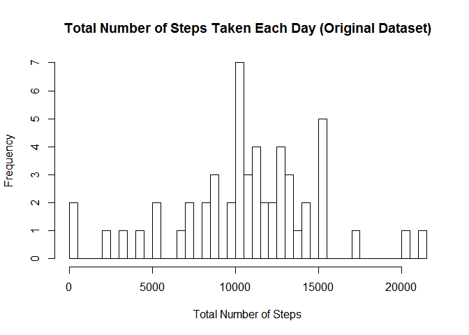

# Reproducible Research: Peer Assessment 1


## Loading and preprocessing the data
###Q1.0
Loading dependancies

```r
library(lubridate)
library(dplyr)
library(ggplot2)
library(Hmisc)
```

###Q1.1
Unzipping the folder and loading the data. For the code to work, the data needs to be downloaded into your working directory.


```r
unzip("./activity.zip", exdir = "activity")
data <- read.csv("./activity/activity.csv", 
                 na.strings = "Not Available", 
                 header = TRUE, sep = ",")
```

###Q1.2  
Preporcessing the data: converting the date and the steps variables into appropriate format

```r
data$date <- ymd(data$date)
data$steps <- as.numeric(as.character(data$steps))
```


## What is mean total number of steps taken per day?
###Q2.1.   
Calculating the total number of steps taken each day

```r
steps_sum <- data %>% group_by(date) %>% 
        summarise(daytotalsteps = sum(steps))
head(steps_sum)
```

```
## Source: local data frame [6 x 2]
## 
##         date daytotalsteps
##       (time)         (dbl)
## 1 2012-10-01            NA
## 2 2012-10-02           126
## 3 2012-10-03         11352
## 4 2012-10-04         12116
## 5 2012-10-05         13294
## 6 2012-10-06         15420
```

```r
tail(steps_sum)
```

```
## Source: local data frame [6 x 2]
## 
##         date daytotalsteps
##       (time)         (dbl)
## 1 2012-11-25         11834
## 2 2012-11-26         11162
## 3 2012-11-27         13646
## 4 2012-11-28         10183
## 5 2012-11-29          7047
## 6 2012-11-30            NA
```

###Q2.2  
Creating a histogram of the total number of steps taken each day

```r
hist(steps_sum$daytotalsteps, 
     breaks = 50,
     main = "Total Number of Steps Taken Each Day (Original Dataset)", 
     xlab = "Total Number of Steps")
```



###Q2.3  
Calculating the mean of the total steps taken per day

```r
mean <- mean(steps_sum$daytotalsteps, na.rm = TRUE)
mean
```

```
## [1] 10766.19
```

Calculating the median of the total steps taken per day

```r
median <- median(steps_sum$daytotalsteps, na.rm = TRUE)
median
```

```
## [1] 10765
```

**Answer:** The mean value of the steps taken by the subject each day is 10766.19 and the median is 10765.


## What is the average daily activity pattern?
###Q3.1.0
Calculating the average number of steps taken per day

```r
steps_mean <- data %>% 
        group_by(interval) %>% 
        summarise(averagestepsinterval = mean(steps, na.rm = TRUE))
```

###Q3.2    
Finding which interval contains the maximum number of steps

```r
max <- steps_mean[which(steps_mean$averagestepsinterval == max(steps_mean$averagestepsinterval, na.rm = TRUE)), ]
max 
```

```
## Source: local data frame [1 x 2]
## 
##   interval averagestepsinterval
##      (int)                (dbl)
## 1      835             206.1698
```

**Answer:** Interval #835 contains the maximum number(n = 206.1698) of steps taken by the subject in the study.

###Q3.1.1  
Creating a plot for the average daily activity pattern with indication of the 5-minute interval containing the maximum number of steps


```r
ggplot(steps_mean, aes(interval, averagestepsinterval)) + 
        geom_line() + 
        geom_point(x = 835, y = 206.1698, color = "red") + 
        labs(title = "Average Daily Activity Pattern", 
             xlab = "Interval", 
             ylab = "Average Number of Steps") +
        scale_x_continuous(breaks = c(0, 500, 835, 1000, 1500, 2000, 2355), 
                           labels = c("0", "500", "835", "1000", "1500", "2000", "2355"))
```


## Imputing missing values
###Q4.1  
Calculating the number of row with NA's

```r
num_missingrows <- sum(!complete.cases(data))
num_missingrows
```

```
## [1] 2304
```

**Answer:** There are 2304 rows in the dataset with missing values.

###Q4.2   
The mean of the respective 5-minute interval will be used to fill in the missing values.

###Q4.3   
Creating a new dataset with the imputed values

```r
data_imp <- data %>% 
        group_by (interval) %>% 
        mutate (steps = impute(steps, mean(steps, na.rm = TRUE)))
head(data_imp)
```

```
## Source: local data frame [6 x 3]
## Groups: interval [6]
## 
##       steps       date interval
##      (impt)     (time)    (int)
## 1 1.7169811 2012-10-01        0
## 2 0.3396226 2012-10-01        5
## 3 0.1320755 2012-10-01       10
## 4 0.1509434 2012-10-01       15
## 5 0.0754717 2012-10-01       20
## 6 2.0943396 2012-10-01       25
```

```r
tail(data_imp)
```

```
## Source: local data frame [6 x 3]
## Groups: interval [6]
## 
##       steps       date interval
##       (dbl)     (time)    (int)
## 1 2.6037736 2012-11-30     2330
## 2 4.6981132 2012-11-30     2335
## 3 3.3018868 2012-11-30     2340
## 4 0.6415094 2012-11-30     2345
## 5 0.2264151 2012-11-30     2350
## 6 1.0754717 2012-11-30     2355
```

###Q4.4.1
Calculating the total number of steps taken each day for the imputed dataset

```r
steps_imp_sum <- data_imp %>% 
        group_by(date) %>% 
        summarise(daytotalsteps_imp = sum(steps))
```

###Q4.4.2
Creating a histogram of the total number of steps taken each day

```r
hist(steps_imp_sum$daytotalsteps_imp, 
            breaks = 50,
            main = "Total Number of Steps Taken Each Day (Imputed Dataset)", 
            xlab = "Total Number of Steps")
```


###Q4.4.3
Calculating the mean of the total steps taken each day for the imputed dataset

```r
mean_imp <- mean(steps_imp_sum$daytotalsteps_imp, na.rm = TRUE)
mean_imp
```

```
## [1] 10766.19
```

###Q4.4.4  
Calculating the median of the total steps taken each day for the imputed dataset

```r
median_imp <- median(steps_imp_sum$daytotalsteps_imp, na.rm = TRUE)
median_imp
```

```
## [1] 10766.19
```

###Q4.4.5  
Comparing the mean and the median for the original and the imputed datasets

Dataset     |Mean Value       |Median Value  
------------|-----------------|-------------  
Original    | 10766.19        | 10765               
Imputed     | 10766.19        | 10766.19               

**Answer:** Comparing the original and the imputed datasets by the mean and the median values of the daily steps taken, reveals little to no difference. To explore the impact of imputing missing values further, we will (1) explore the pattern of missing values, (2) create boxplots for the two datasets, (3) plot the total daily steps taken before and after the imputation.

Subsetting the missing data from the original dataset

```r
data_missing <- data[!(complete.cases(data)), ]
```

Getting the dates with missing values

```r
dates_missing <- unique(data_missing$date)
dates_missing
```

```
## [1] "2012-10-01 UTC" "2012-10-08 UTC" "2012-11-01 UTC" "2012-11-04 UTC"
## [5] "2012-11-09 UTC" "2012-11-10 UTC" "2012-11-14 UTC" "2012-11-30 UTC"
```

Combining the original and the imputed datasets

```r
data$dataset <- as.factor(rep("original", 17568)) ## setting an indicator for the original dataset
data_imp$dataset <- as.factor(rep("imputed", 17568)) ## setting an indicator for the imputed dataset
data_combined <- rbind(data, data_imp)
head(data_combined)
```

```
##   steps       date interval  dataset
## 1    NA 2012-10-01        0 original
## 2    NA 2012-10-01        5 original
## 3    NA 2012-10-01       10 original
## 4    NA 2012-10-01       15 original
## 5    NA 2012-10-01       20 original
## 6    NA 2012-10-01       25 original
```

```r
tail(data_combined)
```

```
##           steps       date interval dataset
## 35131 2.6037736 2012-11-30     2330 imputed
## 35132 4.6981132 2012-11-30     2335 imputed
## 35133 3.3018868 2012-11-30     2340 imputed
## 35134 0.6415094 2012-11-30     2345 imputed
## 35135 0.2264151 2012-11-30     2350 imputed
## 35136 1.0754717 2012-11-30     2355 imputed
```

Calculating the total number of steps taken each day per the respective dataset

```r
steps_comb_sum <- data_combined %>% 
        group_by(dataset, date) %>% 
        summarise(totalsteps = sum(steps))
steps_comb_sum$totalsteps <- as.numeric(steps_comb_sum$totalsteps)
```

Creating a comparison boxplot

```r
ggplot(steps_comb_sum, aes(dataset, log10(totalsteps))) + 
        geom_boxplot() + 
        labs(title = "Comparison between Original and Imputed Datasets", 
             x = "Dataset", y = "log10TotalSteps" )
```


Creating a comparison plot 

```r
ggplot(steps_comb_sum, aes(date, totalsteps)) + 
                geom_line() + 
                labs(title = "Comparison between Original and Imputed Datasets", 
                      x = "Dataset", y = "Total Steps" ) +
                facet_grid(dataset ~ .)
```


**Answer:** The results of the subsequent exploration of the missing values and the impact of imputing them revealed that there are 8 days with missing values for all of the recorded intervals. Imputing the missing values resulted in (1) decreased interquartile range, (2) slight increase in left skewness, and (3) change in the daily dynamics of the total steps taken.


## Are there differences in activity patterns between weekdays and weekends?
###Q5.1
Creating a factor variable in the imputed dataset to indicate the weekdays and weekends

```r
data_imp$day <- ifelse(wday(data_imp$date) == 2|wday(data_imp$date) == 3|wday(data_imp$date) == 4|wday(data_imp$date) == 5|wday(data_imp$date) == 6, "weekday", "weekend")
head(data_imp)
```

```
## Source: local data frame [6 x 5]
## Groups: interval [6]
## 
##       steps       date interval dataset     day
##      (impt)     (time)    (int)  (fctr)   (chr)
## 1 1.7169811 2012-10-01        0 imputed weekday
## 2 0.3396226 2012-10-01        5 imputed weekday
## 3 0.1320755 2012-10-01       10 imputed weekday
## 4 0.1509434 2012-10-01       15 imputed weekday
## 5 0.0754717 2012-10-01       20 imputed weekday
## 6 2.0943396 2012-10-01       25 imputed weekday
```

```r
tail(data_imp)
```

```
## Source: local data frame [6 x 5]
## Groups: interval [6]
## 
##       steps       date interval dataset     day
##       (dbl)     (time)    (int)  (fctr)   (chr)
## 1 2.6037736 2012-11-30     2330 imputed weekday
## 2 4.6981132 2012-11-30     2335 imputed weekday
## 3 3.3018868 2012-11-30     2340 imputed weekday
## 4 0.6415094 2012-11-30     2345 imputed weekday
## 5 0.2264151 2012-11-30     2350 imputed weekday
## 6 1.0754717 2012-11-30     2355 imputed weekday
```

###Q5.2.1
Calculating the average number of steps taken per each interval each day

```r
data_imp_mean <- data_imp %>% 
        group_by(day, interval) %>% 
        summarise(averagesteps = mean(steps))
```

###Q.5.2.2
Creating a plot depicting the differences in the activity patterns between weekdays and weekends

```r
ggplot(data_imp_mean, aes(interval, averagesteps)) + 
        geom_line() + 
        labs(title = "Comparison of Activity Patterns between Weekdays and Weekends", 
        x = "Interval", y = "Average Steps" ) +
        facet_grid(day ~ .)
```


**Answer:** As it can be seen from the plot, there are differences in the activity patterns between weekdays and weekends. More specifically, (1)
on weekdays, the activity patern has major fluctuations, while the activity pattern on weekends is more balanced; (2) the activity on weekends deems to be more intensive (i.e., more steps taken per interval) than on weekdays.The latter is confirmed by the fact that the subject in the study on average, takes more steps on weekends than on weekdays. To follow is the calculation of the mean value of the steps taken depending on the day of the week (i.e., weekdays, weekends) and a table presenting the results.

```r
data_imp_mean_day <- data_imp %>% 
        group_by(day) %>% 
        summarise(averagesteps = mean(steps))
```


Day      | Average Steps Taken
---------|--------------------
Weekdays | 35.61058                  
Weekends | 42.36640     
